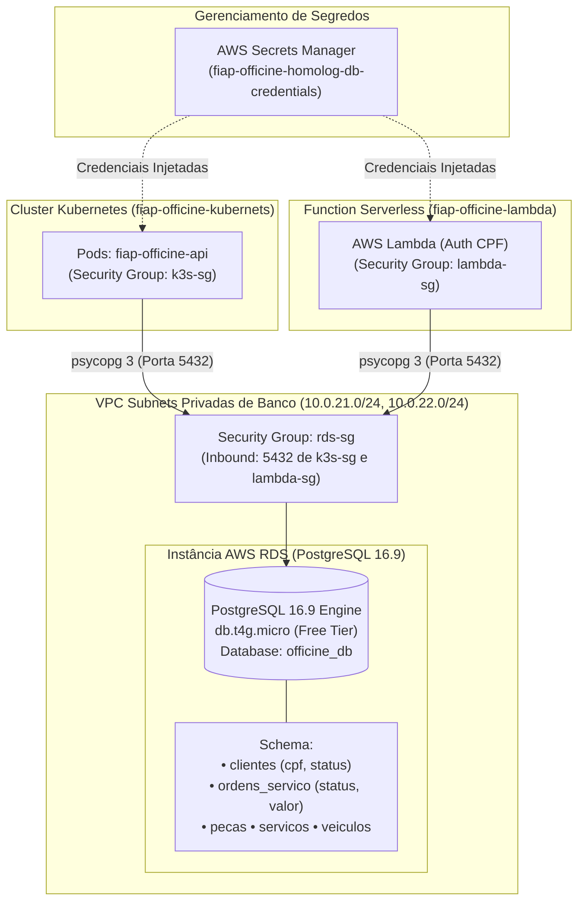

# 🗄️ fiap-officine-database — Banco de Dados Relacional (AWS RDS PostgreSQL)

**Tech Challenge FIAP (15SOAT)**  
Repositório responsável pelo provisionamento, gerenciamento e automação de banco de dados relacional gerenciado (**AWS RDS PostgreSQL 16.9**) e pelo armazenamento seguro de credenciais via **AWS Secrets Manager** para o ecossistema **fiap-officine**.

---

## 🎯 Propósito do Repositório

O **fiap-officine-database** provê a camada de persistência central e transacional para toda a oficina mecânica:
* **Integridade Transacional (ACID)**: Suporte completo a transações para controle de estoque de peças, cálculo e congelamento de orçamentos e máquina de estados de Ordens de Serviço.
* **Segurança e Isolamento de Rede**: O banco opera isolado em **Database Subnets privadas**, sem qualquer endereço IP público ou acesso direto pela Internet. O tráfego na porta `5432` é estritamente restrito aos Security Groups da Lambda de autenticação e dos nós do Kubernetes.
* **Segredos Dinâmicos e Rotação**: As credenciais do administrador (`dbadmin`) são geradas aleatoriamente via Terraform e armazenadas criptografadas no **AWS Secrets Manager**, evitando senhas hardcoded em código.
* **Carga Inicial e Migrations (DDL/Seeds)**: Scripts versionados para criação de tabelas (`clientes`, `veiculos`, `pecas`, `servicos`, `ordens_servico`) e carga inicial de dados com CPFs válidos e ordens em múltiplos status para testes.

---

## 🏗️ Diagrama da Arquitetura do Repositório



---

## 🚀 Tecnologias Utilizadas

| Tecnologia | Uso |
| :--- | :--- |
| **Terraform 1.9+** | Infraestrutura como Código para RDS Subnet Groups, Parameter Groups e DB Instance |
| **AWS RDS PostgreSQL 16.9** | Instância gerenciada Graviton2 (`db.t4g.micro`), Free Tier (750h/mês) |
| **AWS Secrets Manager** | Armazenamento de segredos com chave KMS e auditoria |
| **psycopg 3** | Driver nativo utilizado pelos consumidores para conectar ao PostgreSQL |
| **SQL (PostgreSQL DDL/DML)** | Scripts versionados para criação de schemas e carga de dados de teste |
| **GitHub Actions** | Pipeline automatizada de validação de Terraform e deploy contínuo |

---

## 📡 Documentação das APIs (Swagger & Postman)

Os dados gerenciados por este repositório são consumidos e manipulados através dos microsserviços expostos no API Gateway:

* **Swagger UI (Documentação das Entidades e Endpoints)**:  
  👉 [https://kai652jumh.execute-api.sa-east-1.amazonaws.com/docs](https://kai652jumh.execute-api.sa-east-1.amazonaws.com/docs)
* **OpenAPI Specification (JSON)**:  
  👉 [https://kai652jumh.execute-api.sa-east-1.amazonaws.com/openapi.json](https://kai652jumh.execute-api.sa-east-1.amazonaws.com/openapi.json)
* **ReDoc**:  
  👉 [https://kai652jumh.execute-api.sa-east-1.amazonaws.com/redoc](https://kai652jumh.execute-api.sa-east-1.amazonaws.com/redoc)

### 🔐 Comportamento de Acesso e Códigos de Retorno das Rotas

| Tipo de Rota | Endpoints | Autorização | Comportamento e Resposta |
| :--- | :--- | :--- | :--- |
| **Públicas** | `/health`, `/docs`, `/openapi.json`, `/redoc` | Nenhuma (`NONE`) | `200 OK` (retorna `503 Service Unavailable` apenas em janelas breves de reinicialização ou cold start do nó EC2 Free Tier) |
| **Autenticação** | `POST /auth/login` | Nenhuma (Valida CPF no RDS) | `200 OK` com JWT assinado pela Lambda para clientes ativos cadastrados |
| **Protegidas** | `/api/v1/ordens-servico/*`, `/api/v1/clientes/*`, etc. | **Bearer JWT Obrigatório** | • **Sem Token ou Inválido**: `401 Unauthorized` (rejeitado pelo **Lambda Authorizer** de borda)<br>• **Com Token Válido**: `200 OK` / `201 Created` processado com persistência no PostgreSQL |

---

## 📁 Estrutura do Repositório

```
fiap-officine-database/
├── terraform/
│   ├── versions.tf                       # Provider AWS (~> 6.0) e Random (~> 3.6)
│   ├── modules/
│   │   └── rds/                          # Módulo RDS PostgreSQL + Secrets Manager
│   └── environments/
│       ├── homolog/                      # 100% Free Tier (db.t4g.micro, 20GB gp3, Single-AZ)
│       └── production/                   # Produção Multi-AZ com retention ampliado
├── sql/
│   ├── 01_create_tables.sql              # DDL: clientes (CPF/status) e ordens_servico
│   └── 02_seed_data.sql                  # Carga de teste com CPFs válidos e O.S. nos 3 status
└── .github/workflows/
    └── terraform.yml                     # Pipeline CI/CD para validação e deploy automático
```

---

## 🛠️ Como Executar e Aplicar a Infraestrutura

### 1. Inicializar e Planejar Homologação:
```bash
cd terraform/environments/homolog
terraform init
terraform plan
```

### 2. Aplicar a Infraestrutura na AWS:
```bash
terraform apply -auto-approve
```

### 3. Recuperar a Senha Gerada no AWS Secrets Manager:
```bash
aws secretsmanager get-secret-value \
  --secret-id fiap-officine-homolog-db-credentials \
  --query SecretString \
  --output text \
  --region sa-east-1
```

### 4. Executar os Scripts DDL e Seeds Iniciais:
Através do nó Kubernetes (conectado via AWS SSM):
```bash
psql -h fiap-officine-homolog-rds.chmmasky8j6y.sa-east-1.rds.amazonaws.com \
     -U dbadmin -d officine_db -f sql/01_create_tables.sql

psql -h fiap-officine-homolog-rds.chmmasky8j6y.sa-east-1.rds.amazonaws.com \
     -U dbadmin -d officine_db -f sql/02_seed_data.sql
```

---

## 🛰️ Recursos Ativos em Homologação (AWS sa-east-1)

* **Endpoint do RDS**: `fiap-officine-homolog-rds.chmmasky8j6y.sa-east-1.rds.amazonaws.com:5432`
* **Nome do Banco**: `officine_db`
* **Usuário Administrador**: `dbadmin`
* **Engine**: PostgreSQL 16.9 (AWS Graviton2 `db.t4g.micro`, 100% Free Tier)
* **Secret no AWS Secrets Manager**: `fiap-officine-homolog-db-credentials-292943bddde1a5688921879f8c`
* **Clientes de Teste Pré-Cadastrados**:
  - `Carlos Eduardo Ferreira` (CPF: `52998224725`, Status: `ATIVO`)
  - `Mariana Souza Santos` (CPF: `11144477735`, Status: `ATIVO`)

---

## 🔒 Governança de Branches
* **Branch `main` e `develop` protegidas** contra commits diretos.
* **Uso obrigatório de Pull Requests** com validação de `terraform fmt`, `terraform validate` e `terraform plan`.
* **Deploy Automático**:
  - Push/Merge em `develop` ➔ Deploy automático para **Homologação**.
  - Push/Merge em `main` ➔ Deploy automático para **Produção**.
